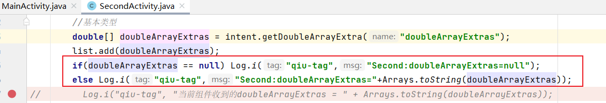

q1.apk：原始apk，没有手动插入log语句。as生成的时候自动签了名。

q1_1.apk：表示手动插入了一条语句：Log.i("qiu-tag",action);生成时自动签名。

q1_2.apk：手动插入了一堆获取intent属性的语句以及相应的log语句。

q1_3.apk：保留获取intent属性的语句，去掉了相应的log语句，用于插桩测试用。弃，因为获取属性没有保存下来。

q1_5.apk: 和q1.apk差不多，用来专门对基本属性获取点进行插桩

q6.apk：

​	修改内容如下，用来查看如何插桩这一段代码的。对应Jimple文件4文件夹。

​	

q7.apk**插桩测试用**！

jimple输出文件1：q1_1.apk的Jimple文件,用来查看具体的log语句是怎么样的，方便有参照怎么插桩

jimple输出文件2：q1_2.apk的Jimple文件,用来查看具体的log语句是怎么样的，方便有参照怎么插桩

插桩结果1

存放第一次插桩结果，没有考虑到uri可能为null导致空指针异常，包括：
